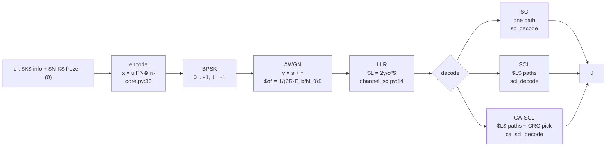
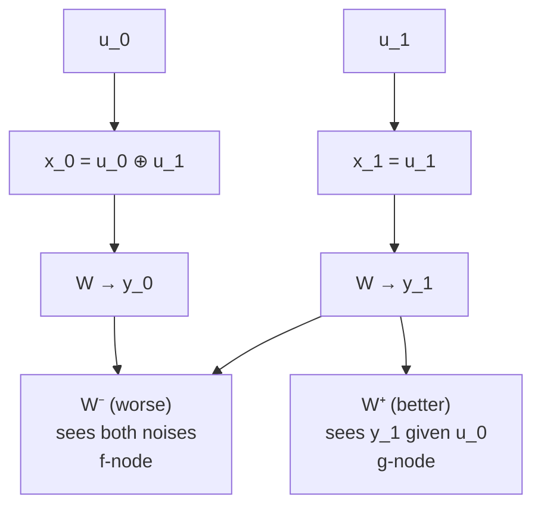
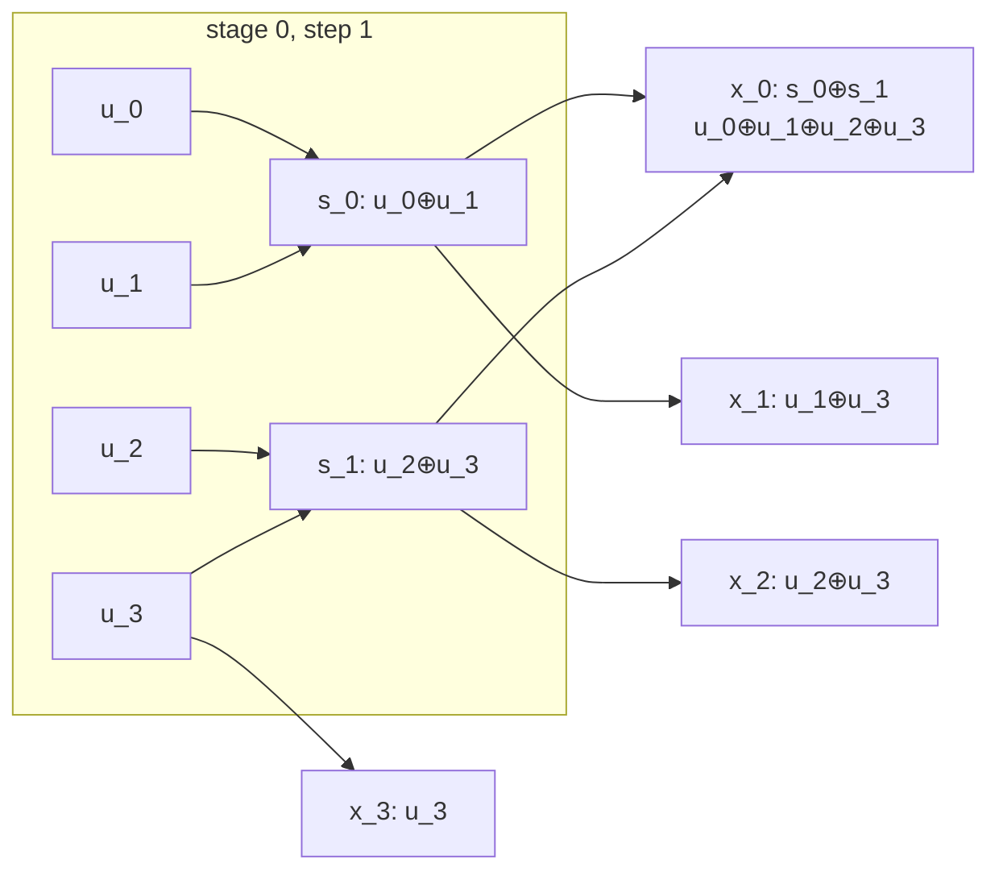
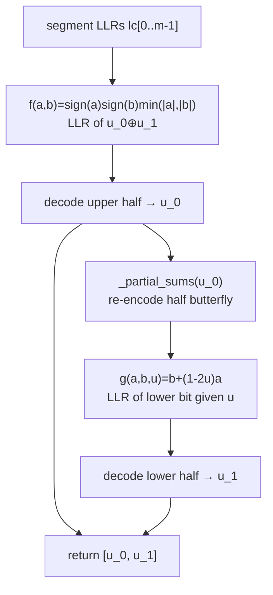
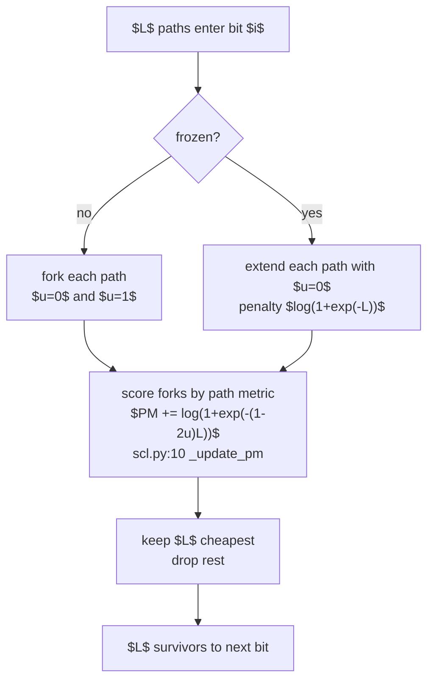

# Polar codes from the ground up

A plain-English walk through this codebase, with the smallest example that still shows every idea. Read it with `src/polar/` open.

## The big picture in one sentence

Polar codes turn $N$ identical noisy channels into $N$ new channels where most are almost perfect and most are almost useless, then put data only on the perfect ones.



Every later section is one box in that flow. Function references use `file:line` so you can jump directly.

---

## 1. What polarization actually does

Take one noisy channel $W$. Mix two copies with an XOR and you get two new channels:



One got worse, one got better. The total capacity stayed the same. Do that again and the split sharpens. By $N=1024$, almost every synthetic channel $W_N^{(i)}$ sits near $0$ (useless) or $1$ (perfect). `fig01_polarization_bec.png` shows that snap: at $N=32$ the points slope, at $N=1024$ they cling to the top and bottom.

> **Related functions:** The split is driven by `core.py:53 frozen_set_bec` and `core.py:81 _phi` / `core.py:98 _phi_inv` for the AWGN case. Visualized by `scripts/generate_figures.py:60 fig_polarization_bec` and `:84 fig_polarization_histogram`.

This is **principle-model-the-domain** in the code: the domain is a set of $N$ ordered reliabilities, so the construction modules output a sorted vector $Z[N]$ or $m[N]$, not scattered conditionals.

---

## 2. Encoding: the butterfly that does the mixing

`encode` in `core.py:30` implements $x = u F^{\otimes n}$ as $n$ stages of XORs. $N=4$ is the smallest that shows two stages:



In code:

```python
v = u.copy()
step = 1
for _ in range(n):          # n = log2 N stages
    for i in range(0, N, 2*step):
        for j in range(step):
            v[i+j] ^= v[i+j+step]
    step *= 2
```

For $u=[1,0,1,1]$ this gives $x=[0,1,0,1]$ — check with `core.py:30 encode` directly. The transform is its own inverse, so `encode(encode(u)) == u` in `tests/test_basic.py`.

The half-size version of this same butterfly reappears as `channel_sc.py:51 _partial_sums` during decoding. That reuse is intentional.

> **Related functions:** `core.py:30 encode` (butterfly), `core.py:8 kron_power` and `core.py:21 bit_reverse` (matrix view, not on hot path), `channel_sc.py:51 _partial_sums` (same butterfly half-size).

---

## 3. The channel in one number: the LLR

BPSK sends $s = 1-2x$, so $0 \to +1$ and $1 \to -1$. AWGN adds $n \sim \mathcal{N}(0,\sigma^2)$ to give $y = s+n$.

Decoders never use $y$ directly. They use

$$L = \log \frac{P(y|0)}{P(y|1)} = \frac{2y}{\sigma^2}$$

in `channel_sc.py:14 awgn_llr`. Sign picks the bit ($\ge 0$ leans to $0$), magnitude says confidence. $L=10$ is sure, $L=0.2$ is a guess.

$\sigma$ comes from the $E_b/N_0$ you report on the x-axis:

$$\sigma^2 = \frac{1}{2 R \cdot E_b/N_0}$$

The $R$ matters. $E_b$ is per info bit, not per transmitted symbol. Forgetting $R$ shifts curves by $10\log_{10}(R)$, about $-3$ dB at $R=1/2$. `tests/test_channel.py` locks this by checking uncoded BPSK hits $Q(\sqrt{2\cdot E_b/N_0}) \approx 0.0786$ at $0$ dB.

> **Related functions:** `channel_sc.py:9 snr_to_sigma` (the $\sigma$ formula), `channel_sc.py:14 awgn_llr` (BPSK map $s=1-2x$ plus $L=2y/\sigma^2$), `core.py:117 awgn_construction` (uses same $\sigma$ for design SNR).

---

## 4. Which positions are good: construction

After polarization, each position $i$ has a different reliability. Put data on the $K$ best, freeze the rest to $0$.

### BEC: exact $Z$ — `core.py:53 frozen_set_bec`

$Z \in [0,1]$ where $0$ is perfect. Start $Z=\epsilon$. Each stage:

$$Z^- = 2Z - Z^2 \quad \text{(upper, worse)}$$
$$Z^+ = Z^2 \quad \text{(lower, better)}$$

For $N=4$, $\epsilon=0.5$:

* level 0: $[0.5]$
* level 1: $[0.75,\; 0.25]$
* level 2: $[0.9375,\; 0.5625,\; 0.4375,\; 0.0625]$

Sorted good-to-bad: $i=3,2,1,0$. With $K=2$, `frozen=[True,True,False,False]`. `fig03_frozen_pattern.png` draws these bars for $N=64`.

> **Related functions:** `core.py:53 frozen_set_bec` (exact $Z$ recursion, returns `frozen[N]` mask), `scripts/generate_figures.py:22 _bhattacharyya_vec` (same recursion unwrapped for plots).

### AWGN: mean LLRs — `core.py:117 awgn_construction`

Track mean LLR $m$ with $m_0 = 2/\sigma^2$. Lower: $2m$. Upper: $\phi^{-1}(1-(1-\phi(m))^2)$ where $\phi(x)=\mathbb{E}[\tanh(L/2)]$ in `core.py:81 _phi` maps $m$ through the probability domain and back. Freeze the smallest $m$. Design SNR should match where you operate — see `fig04_design_snr.png`.

At matched capacity the two methods agree heavily. At $N=128$, $R=1/2$, BEC $\epsilon=0.5$ and GA at $1$ dB share all 64 info positions.

> **Related functions:** `core.py:117 awgn_construction` (main entry), `core.py:81 _phi` and `core.py:98 _phi_inv` (Ha et al. approx + bisection), `channel_sc.py:9 snr_to_sigma` (design $\sigma$), `scripts/generate_figures.py:38 _ga_means` and `:145 fig_design_snr_effect` (visualize design-SNR shift).

---

## 5. SC decoding: unmixing in order

SC decides $u_0$, then $u_1$ given $u_0$, up to $u_{N-1}$. Two updates power each recursion in `channel_sc.py:65 _decode_recursive`:



* $f$ in `channel_sc.py:28 f`: the XOR. Confident only if both inputs are confident and agree. Min-sum drops the exact $\log(1+\cdot)$ correction at tiny loss.
* $g$ in `channel_sc.py:40 g`: the lower bit. If the upper bit $u=0$, observations add ($b+a$). If $u=1$, they subtract ($b-a$).

The subtlety is `channel_sc.py:51 _partial_sums`. The $u$ in $g$ is not the raw decoded bit. It is that bit re-encoded through the half-size butterfly — the same code as `encode`. For $N=4$, the top decision must be XORed before it conditions the bottom. Using raw bits still passes $N=4$ and fails silently at $N=16$. The comment `decisions (NOT partial codeword)` in `channel_sc.py:84` exists for that reason.

`channel_sc.py:87 sc_decode` recurses over contiguous halves. `channel_sc.py:101 sc_llr` walks only the single root-to-leaf path for bit $i$. Same arithmetic, no full decode.

> **Related functions:** `channel_sc.py:28 f`, `channel_sc.py:40 g`, `channel_sc.py:51 _partial_sums`, `channel_sc.py:65 _decode_recursive`, `channel_sc.py:87 sc_decode`, `channel_sc.py:101 sc_llr` (shared by SCL per `scl.py:20`).

---

## 6. When one story is not enough: SCL

SC commits early. One wrong early guess poisons the rest. SCL in `scl.py:21 scl_decode` keeps $L$ stories:



Lower PM means more likely. Near $0$ when the guess matches $L$, near $|L|$ when it fights $L$. $L=1$ is SC. This version copies full vectors, so cost is $O(L\cdot n^2)$. The paper's Algs 8–13 share memory to reach $O(L\cdot n \log n)$ — traded here for readability per **principle-laziness-protocol**.

> **Related functions:** `scl.py:10 _update_pm`, `scl.py:21 scl_decode` (fork-rank-prune loop, calls `channel_sc.py:101 sc_llr` per path per bit), `channel_sc.py:101 sc_llr` (LLR engine reused here).

---

## 7. A checksum to pick the right story: CA-SCL

Often the true codeword sits in the list but not on top. Append 16 CRC bits with `crc.py:19 append_crc` in `crc.py`, list-decode, then `scl.py:50 ca_scl_decode` scans best-first and returns the first path that passes `crc.py:27 check_crc`. If none passes, fall back to the best path.

With fixed $K$, those 16 bits eat data space, so at $N=128$ CA-SCL can trail plain SCL. At $N=2048$ the gain dominates. The harness counts only message bits, so this is visible in the curves when you compare at fixed message length.

> **Related functions:** `crc.py:5 crc16_bits`, `crc.py:19 append_crc`, `crc.py:27 check_crc`, `scl.py:50 ca_scl_decode` (best-first CRC scan over `scl.py:21 scl_decode` candidates).

---

## 8. Putting it together and reproducing the paper

`sim.py:10` ties the pipeline into one Monte Carlo point: draw `n_blocks` random messages with a fixed seed, `encode`, `awgn_llr` at rate $K/N$, decode with `sc`/`scl`/`ca-scl`, count BER over message bits and FER over blocks.

```python
# one point, reproducible
from polar.core import awgn_construction
from polar.sim import run_point
frozen = awgn_construction(256, 128, design_snr_db=1.0)
ber, fer = run_point(256, 128, frozen, snr_db=2.0, decoder="scl", L=8, n_blocks=80)
```

`scripts/replicate_tal_vardy.py` loops that over $E_b/N_0$. `scripts/generate_figures.py` adds the visualization suite:

| Figure | What it shows | Paper analog |
|---|---|---|
| `fig01_polarization_bec.png` | Sorted $Z$ as point clouds for $N=32,128,512,1024$ — the snap to $0$/$1$ | Arikan Fig. 4 |
| `fig02_histogram.png` | Histogram of $Z$ at $N=1024$ — the bimodal count | Arikan Fig. 4, rotated |
| `fig03_frozen_pattern.png` | Frozen bars for BEC vs GA plus sorted reliability overlay | Arikan Fig. 9 |
| `fig04_design_snr.png` | How design $E_b/N_0$ shifts GA reliability and frozen overlap | Tal-Vardy 2013 Fig. 2 |
| `fig05_butterfly.png` | Butterfly stages $u \to x$ for $N=8$ | Arikan Figs. 5/9 |
| `fig06_fer_vs_snr.png` | BER/FER vs $E_b/N_0$ for SC and SCL/CA-SCL at several $L$ | Tal-Vardy 2012 Figs. 1/5 |
| `fig07_fer_vs_L.png` | FER vs list size $L$ at fixed SNR | Tal-Vardy 2012 Fig. 1, rotated |

Quick run (about a minute, point clouds plus one decoding curve):

```bash
uv sync
uv run pytest tests/ -q
uv run python scripts/generate_figures.py --quick
```

Paper-scale (slower — start small and scale $N$, $L$, blocks):

```bash
uv run python scripts/generate_figures.py --full
uv run python scripts/replicate_tal_vardy.py --N 1024 --K 512 --snrs 1.0 1.5 2.0 2.5 --blocks 200 --L 32
```

---

## How to keep going

* Trace $N=8$ by hand: encode a random $u$, compute $Z$ with $\epsilon=0.5$, mark frozen, walk SC with LLRs $[10,-10,-10,10,\dots]$.
* Change `design_snr_db` from $1$ to $3$ and watch `fig04`'s overlap drop.
* Fix $E_b/N_0=2$ dB and sweep $L=1,2,4,8,16,32$ with `fig07` — FER falls then flattens, which is the diminishing return Tal-Vardy reports.
* Replace min-sum $f$ with exact boxplus $\log((1+e^{a+b})/(e^{a}+e^{b}))$ and measure the small FER gap.

Glossary for every term lives in `GLOSSARY.md`. Method notes with conventions and known limits are in `docs/method.md`.
